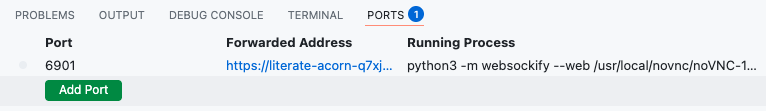
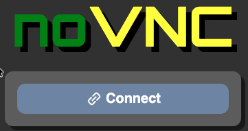
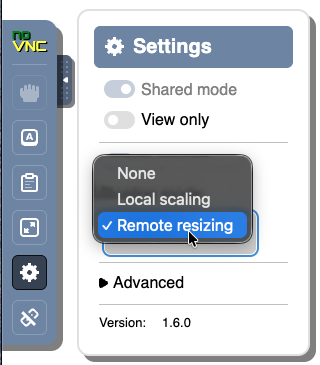

# StudentCodespaceBase

The StudentCodespaceBase is a Debian Linux container that runs in GitHub Codespaces and provides a GUI desktop, providing a simple low to no cost way for students to spin up a Linux machine for class work, activities or projects.

In addition to the base Debian Liunux and the GUI desktop the following are also installed:
- Docker (via Docker on Docker)
- Git
- GitHub CLI (`gh`)
- Firefox
- `vim`, `nano`
- `wget`, `curl`
- `man`

## Usage

1. Log into GitHub
2. Click the button below to start a new StudentCodespaceBase container or to restart an existing one.
   <br><a href='https://codespaces.new/braughtg/StudentCodespaceBase?quickstart=1'></a>
3. Wait for the codespace to be created (~5 minutes) or restarted (~1 minute). The following message will appear in the "TERMINAL panel" at the bottom of the window when the codespace is ready.
   ```text
   *******************
   Codespace is ready!
   *******************
   ```
5. Open the "PORTS tab" from the menu bar above the "Terminal panel".

   
6. Open the noVNC connection by...
   1. pointing at the `https` link under "Forwarded Address" in the "Ports tab" 
   2. and then either:
      - Right clicking and choosing "Open in Browser".
      - Or by clicking the "Globe" icon.
7. Click on the "noVNC Connect button"

   
8. Use the "noVNC menu" at the left of the window to set the "Scaling Mode" to "Remove resizing".
  
   
9. Right click anywhere in the window (i.e. on the GUI Desktop) and open a Terminal to get started.

## Stopping a Codespaces

1. Visit your [Codespaces page](https://github.com/codespaces).
   - If the page was already open, you'll need to reload it to update it with the current status.
2. Click the "..." to the right of the Codespace you want to stop.
3. Choose "Stop codespace".

## Extending the Container


